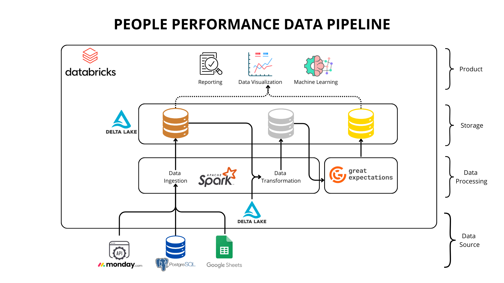
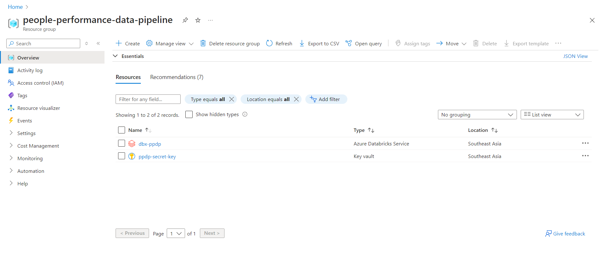
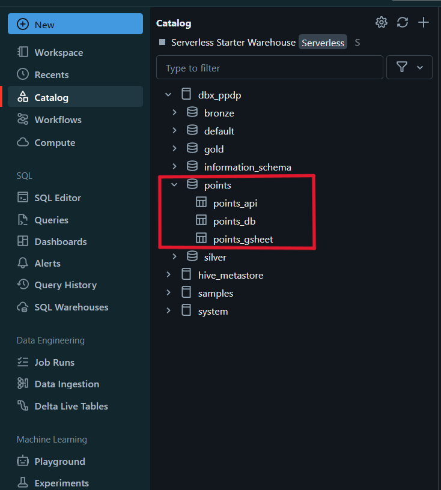
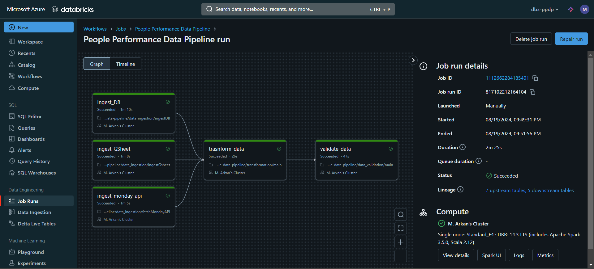

# Intro
In the competitive business environment, effective employee performance management is crucial for maintaining productivity and achieving organizational goals. However, HR departments often struggle with gathering, managing, and analyzing performance data from various sources, which can lead to delayed or inaccurate insights. The "People Performance Data Pipeline" project addresses this business problem by providing a streamlined process for collecting and managing performance indicators, such as daily tasks, from multiple data sources (APIs, databases, and Google Sheets). This project aims to enhance the HR department's ability to report on, visualize, and predict employee performance, ultimately leading to more informed decision-making and improved productivity across the company.
# Goals
The primary goals of the People Performance Data Pipeline project include:

1. <b>Centralized Data Management</b>: Collect and consolidate employee performance data from diverse sources into a single Delta Lake storage solution. This centralized approach ensures that all relevant data is readily accessible for analysis.

2. <b>Data Transformation and Standardization</b>: Convert raw performance data into meaningful metrics by assigning points to tasks and standardizing the data format. This transformation allows for easy calculation and comparison of employee performance across different departments.

3. <b>Data Quality Assurance</b>: Implement rigorous data validation processes to ensure the accuracy and reliability of the data stored in the Delta Lake. High-quality data is essential for generating trustworthy insights and making sound business decisions.

4. <b>Enhanced Reporting and Analytics</b>: Provide HR with the tools to generate detailed performance reports, create data visualizations, and leverage machine learning models to predict and boost departmental performance. This goal directly ties to improving key business metrics such as employee productivity, retention rates, and overall company efficiency.

# Solution


# Installation
1. Create new resource group in microsoft azure and add azure key vault and databricks into the resource group

2. Store the secret key, such as API key, Database link, Google Sheet URL, etc.
3. Clone this repo
    ```bash
    git clone https://github.com/ArkanNibrastama/people_performance_data_pipeline.git
    ```
4. Make points delta_lake and store .csv file in points folder. Also make delta lake for bronze, silver and gold stage

5. Copy data_ingestion, transformation, and data_validation folder into databricks
6. After that make a job from the notebook like this


# Conclusion
The implementation of the People Performance Data Pipeline has had a significant impact on the HR department's ability to manage and analyze employee performance data. By centralizing and standardizing data from multiple sources, and processing over <b>10,000+ data</b> using PySpark, the project has <b>reduced the process in HR department</b> by approximately <b>75%</b>, enabling faster and more accurate reporting. The data validation processes have <b>ensured high data quality</b>, leading to more reliable insights and predictions. As a result, the HR department has been able to identify underperforming areas and take proactive measures to boost productivity, contributing to increase in overall company performance. This project demonstrates the value of leveraging data engineering and machine learning to drive business success.